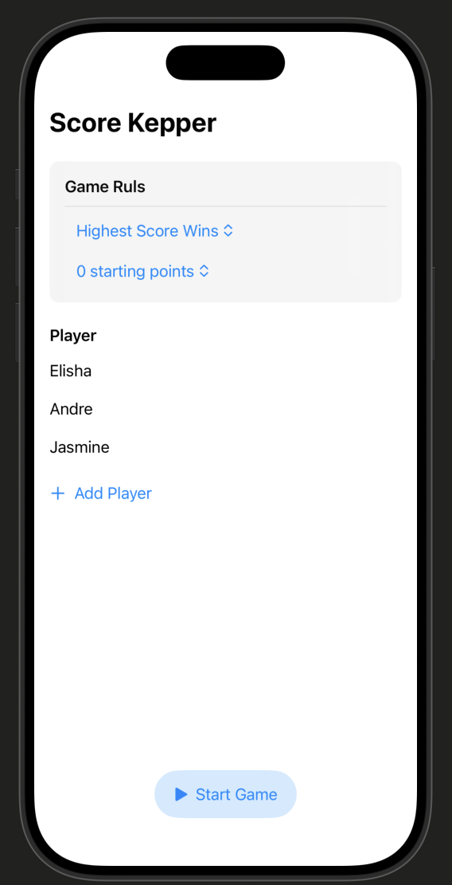
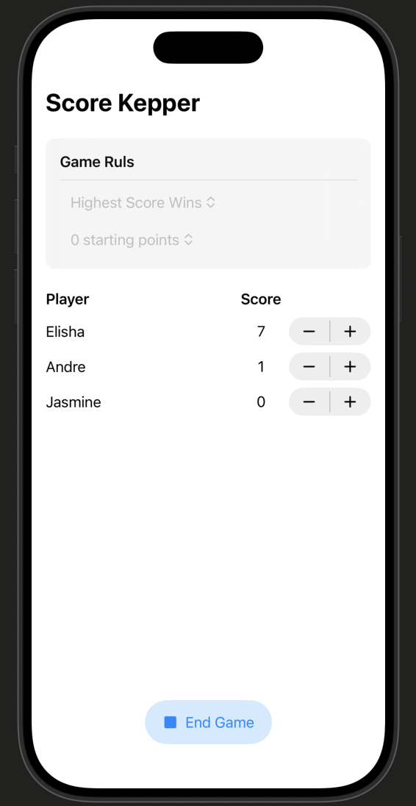
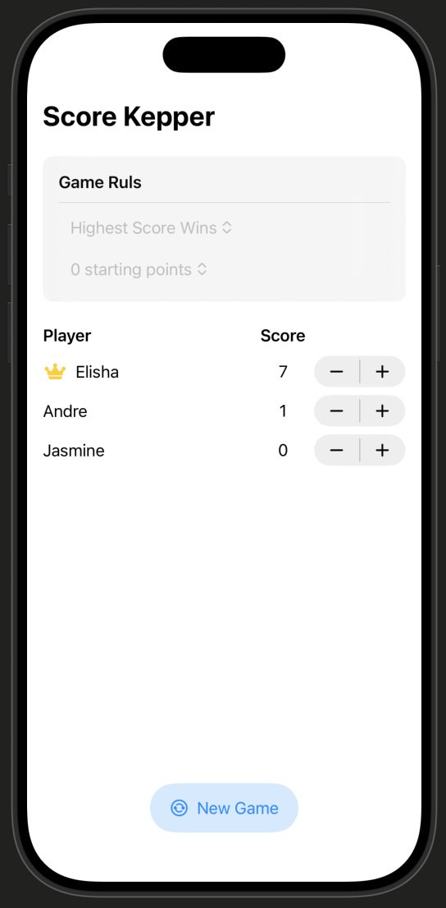

# 06. ScoreKeeper

SwiftUI를 활용한 보드게임 점수 관리 앱입니다. Apple의 SwiftUI 튜토리얼 시리즈 6번째 챕터로, Swift의 커스텀 타입, 열거형, 그리고 Swift Testing 프레임워크를 학습합니다.

## 주요 기능

- 플레이어 추가 및 이름 설정
- 게임 진행 중 Stepper로 점수 조절
- 게임 규칙 설정 (최고 점수 / 최저 점수 승리)
- 시작 점수 설정 (0 / 10 / 20점)
- 게임 종료 시 우승자에게 왕관 표시
- 게임 상태 관리: Setup → Playing → Game Over

## 스크린샷

| Setup | Playing | Game Over |
|:-----:|:-------:|:---------:|
|  |  |  |

## 프로젝트 구조

```
06. ScoreKeeper/
├── ContentView.swift      # 메인 UI - 플레이어 목록, 점수판, 게임 제어 버튼
├── SettingsView.swift     # 게임 규칙 설정 UI (승리 조건, 시작 점수)
├── Scoreboard.swift       # 게임 상태와 점수 로직을 담은 모델
├── Player.swift           # 플레이어 데이터 모델
├── GameState.swift        # 게임 상태를 나타내는 열거형
└── 06. ScoreKeeperTests/
    └── _6__ScoreKeeperTests.swift  # Swift Testing 기반 단위 테스트
```

## 학습 내용

### 커스텀 타입
- `struct`로 `Player`, `Scoreboard` 모델 설계
- `Identifiable` 프로토콜로 SwiftUI 리스트 바인딩 지원
- `Equatable` 프로토콜 커스텀 구현으로 플레이어 비교 가능

### 열거형 (Enum)
- `GameState` 열거형으로 게임 상태(setup / playing / gameOver)를 명확하게 표현
- `switch` 문으로 상태에 따른 UI 분기 처리

### mutating func
- `struct` 내부에서 `mutating func`를 사용해 점수 초기화 구현

### Swift Testing
- `@Test` 어노테이션과 `#expect`를 활용한 단위 테스트 작성
- `arguments`를 사용한 파라미터화 테스트 (여러 시작 점수 검증)

### SwiftUI
- `@Binding`으로 부모-자식 뷰 간 데이터 공유
- `Grid` / `GridRow`로 표 형태의 점수판 레이아웃 구성
- `Picker`에서 `.tag()`를 활용한 선택값 바인딩
- `@Previewable` 매크로로 미리보기에서 동적 속성 사용
