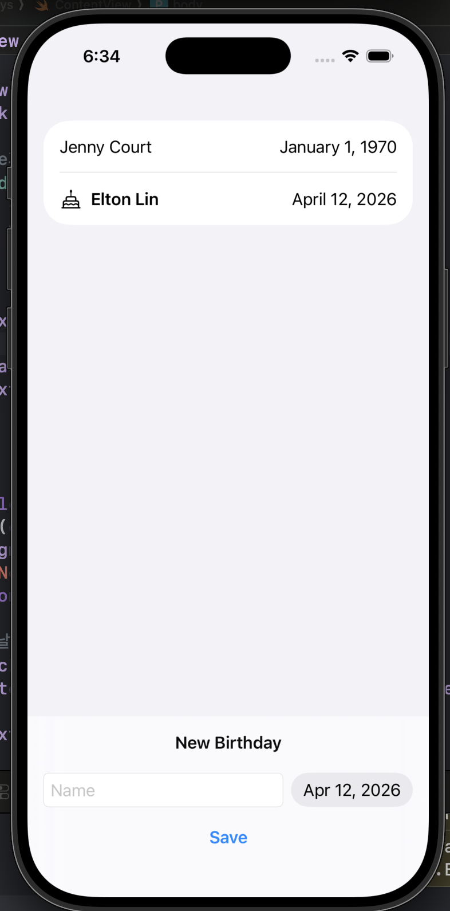
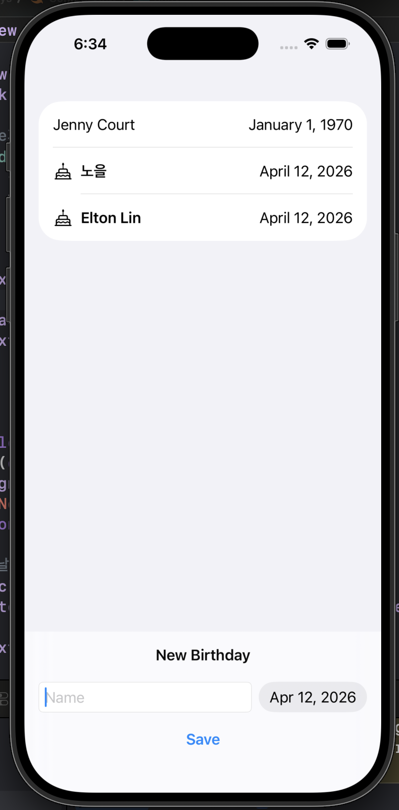
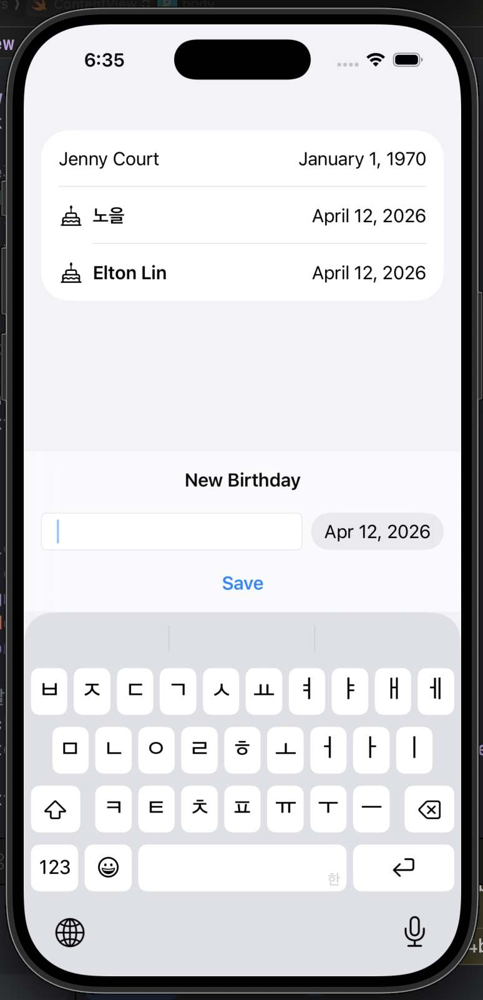

# 07. Birthdays

SwiftUI와 SwiftData를 활용한 친구 생일 관리 앱입니다. Apple의 SwiftUI 튜토리얼 시리즈 7번째 챕터로, SwiftData를 통한 데이터 영속성과 모델 설계를 학습합니다.

## 주요 기능

- 친구 이름과 생일 입력 후 저장
- 생일 오름차순 정렬 목록 표시
- 오늘 생일인 친구에게 케이크 아이콘 및 볼드체 강조
- 미래 날짜 입력 방지 (DatePicker 범위 제한)
- SwiftData로 앱 재실행 후에도 데이터 유지

## 스크린샷

| List | Birthday Today | Input |
|:----:|:--------------:|:-----:|
|  |  |  |

## 프로젝트 구조

```
07. Birthdays/
├── ContentView.swift          # 메인 UI - 친구 목록, 생일 입력 폼
├── Friend.swift               # SwiftData 모델 클래스
└── _7__BirthdaysApp.swift     # 앱 진입점, modelContainer 설정
```

## 학습 내용

### SwiftData
- `@Model` 매크로로 데이터 모델 클래스 선언
- `modelContainer(for:)`로 앱 전체에 데이터 컨텍스트 제공
- `@Query`로 데이터를 자동으로 fetch 및 정렬 (`sort: \Friend.birthday`)
- `@Environment(\.modelContext)`로 컨텍스트 접근
- `context.insert(_:)`로 새 데이터 저장

### 클래스 vs 구조체
- SwiftData 모델은 `class`로 선언 (고유 식별자 필요)
- `class` 인스턴스는 앱 전체에서 동일 참조를 공유

### SwiftUI
- `safeAreaInset(edge:)`로 화면 하단에 입력 폼 고정
- `DatePicker`에서 `in:` 범위 파라미터로 선택 가능한 날짜 제한
- `.task` modifier로 뷰 표시 전 비동기 초기화 실행
- `NavigationStack` + `navigationTitle`로 네비게이션 구성
