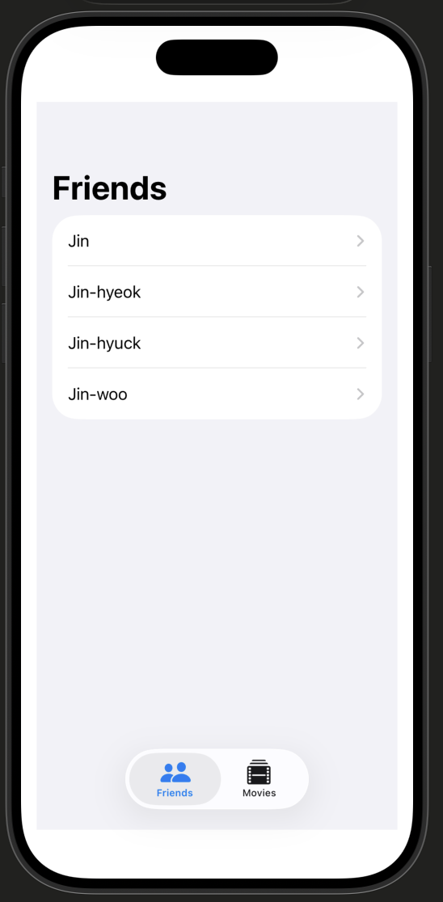
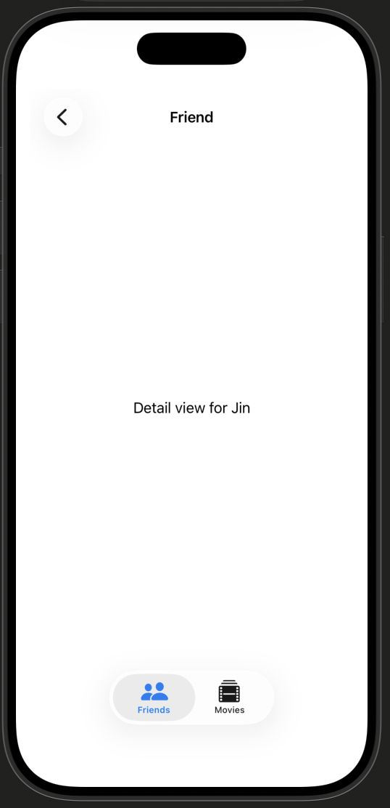
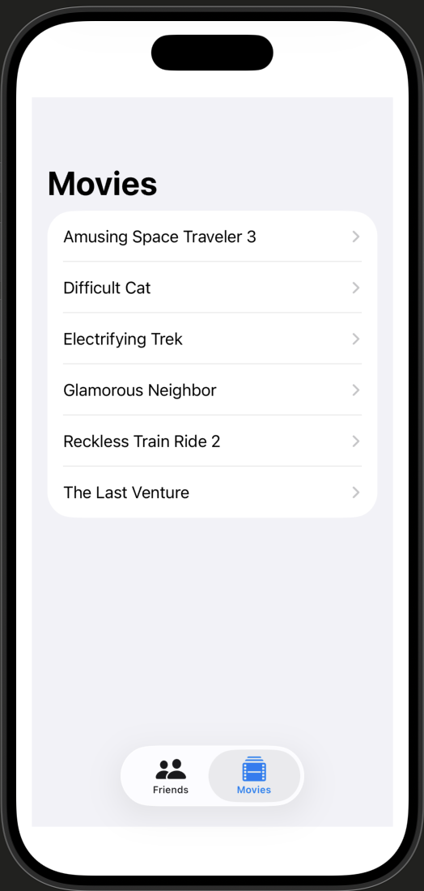
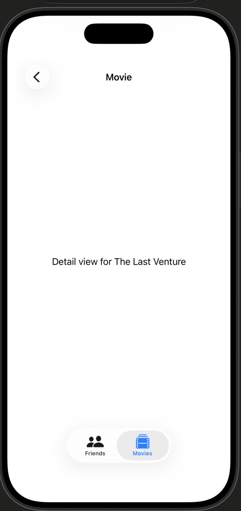

# 08. FriendsFavoriteMovies

SwiftUI와 SwiftData를 활용한 친구 및 영화 관리 앱입니다. Apple의 SwiftUI 튜토리얼 시리즈 8번째 챕터로, 내비게이션, 탭 뷰, 다중 모델 관계 설계를 학습합니다.

## 주요 기능

- Friends / Movies 탭으로 분리된 UI
- 친구 목록과 영화 목록을 이름/제목 오름차순 정렬
- `NavigationSplitView`로 목록 → 상세 화면 전환
- 메모리 전용 샘플 데이터로 프리뷰 지원

## 스크린샷

| Friends | Friend Detail | Movies | Movie Detail |
|:-------:|:-------------:|:------:|:------------:|
|  |  |  |  |

## 프로젝트 구조

```
08. FriendsFavoriteMovies/
├── ContentView.swift      # TabView로 Friends / Movies 탭 구성
├── FriendList.swift       # 친구 목록 (NavigationSplitView)
├── MovieList.swift        # 영화 목록 (NavigationSplitView)
├── Friend.swift           # Friend SwiftData 모델
├── Movie.swift            # Movie SwiftData 모델
└── SampleData.swift       # 프리뷰용 인메모리 샘플 데이터
```

## 학습 내용

### 내비게이션
- `NavigationSplitView`로 마스터-디테일 레이아웃 구성
- `NavigationLink`로 목록 항목 탭 시 상세 화면 전환
- `detail:` 클로저로 기본 상세 화면 설정

### TabView
- `Tab(_:systemImage:)`으로 탭 항목 구성
- SF Symbols 아이콘 활용 (`person.and.person`, `film.stack`)

### SwiftData 다중 모델
- `Schema`에 여러 모델(`Friend`, `Movie`) 등록
- `ModelContainer(for:configurations:)`로 컨테이너 초기화
- 모델별 독립적인 `@Query`로 각 목록 fetch 및 정렬

### 프리뷰용 샘플 데이터
- `@MainActor` 클래스로 메인 스레드 접근 보장
- `isStoredInMemoryOnly: true` 설정으로 실제 저장 없이 프리뷰 구동
- 싱글톤 패턴(`shared`)으로 샘플 컨테이너 공유
