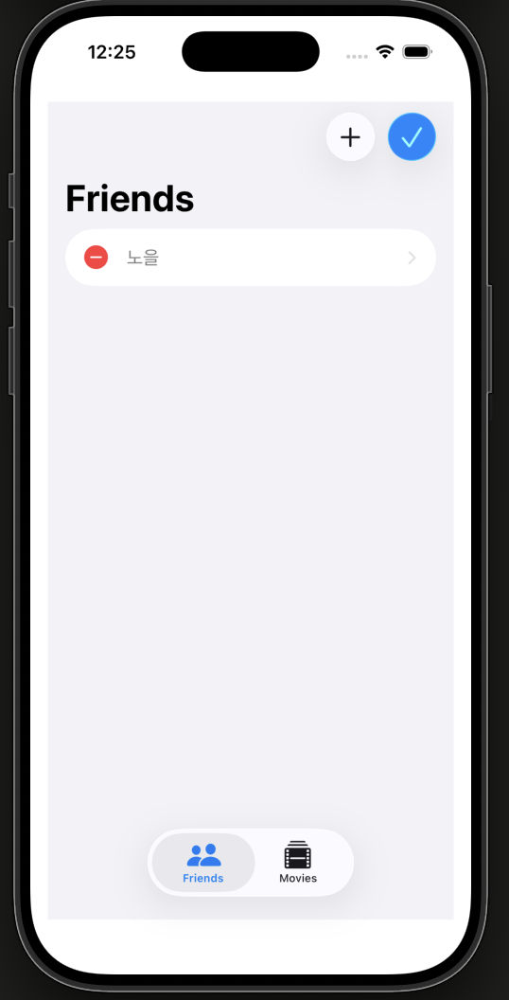
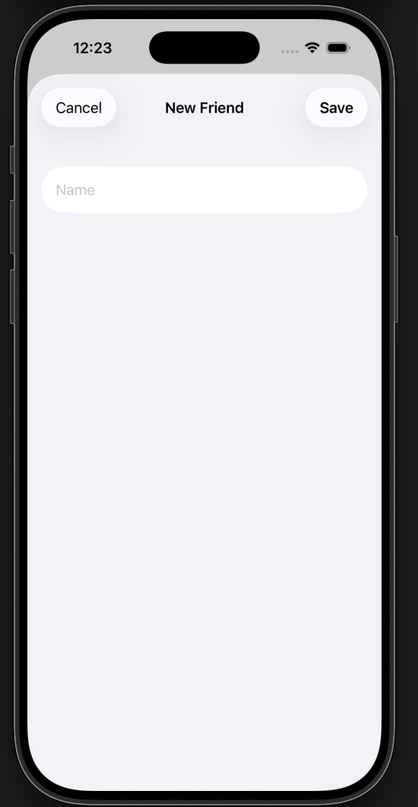
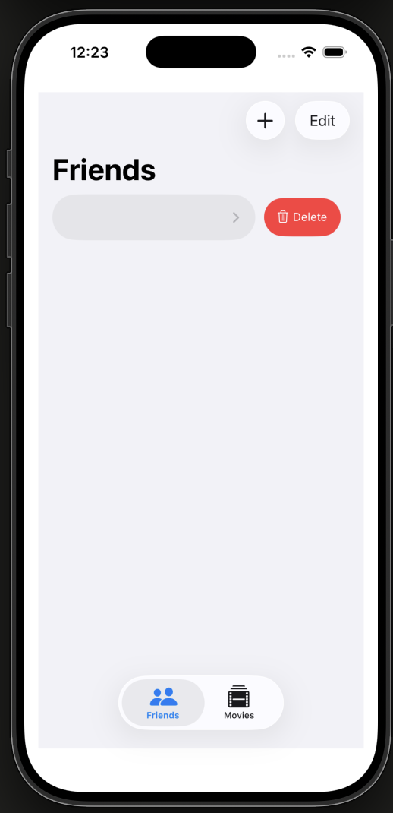
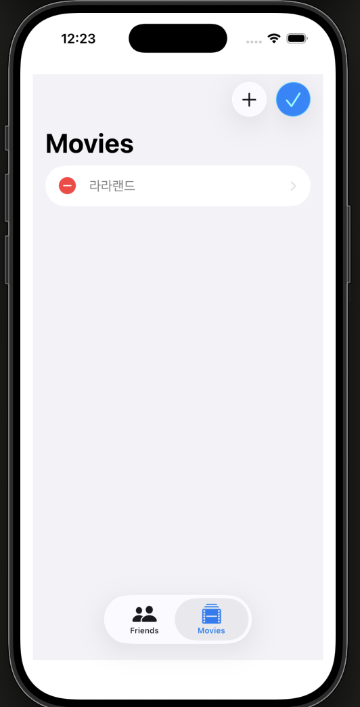
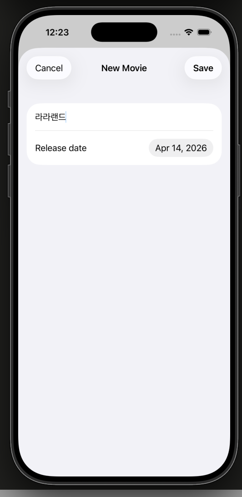
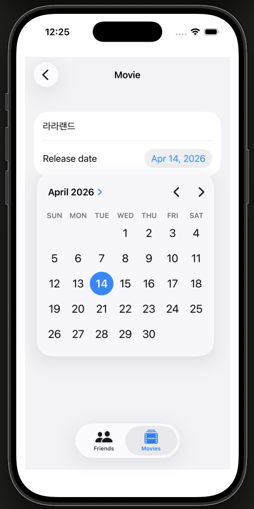
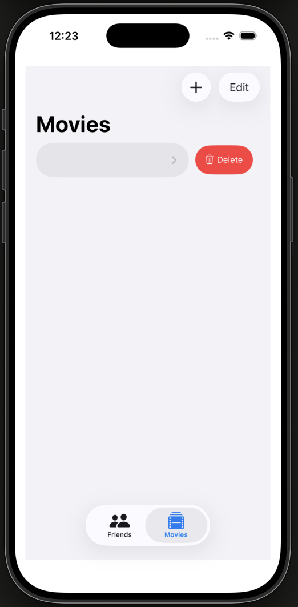

# 08. FriendsFavoriteMovies

SwiftUI와 SwiftData를 활용한 친구 및 영화 관리 앱입니다. Apple의 SwiftUI 튜토리얼 시리즈 8번째 챕터로, 내비게이션, 탭 뷰, 다중 모델 관계 설계를 학습합니다.

## 주요 기능

- Friends / Movies 탭으로 분리된 UI
- 친구 목록과 영화 목록을 이름/제목 오름차순 정렬
- `NavigationSplitView`로 목록 → 상세 화면 전환
- 메모리 전용 샘플 데이터로 프리뷰 지원

## 스크린샷

**Friends**

| 목록 | 편집 모드 | 새 친구 추가 | 스와이프 삭제 |
|:----:|:---------:|:------------:|:------------:|
|  |  |  |  |

**Movies**

| 목록 (편집 모드) | 새 영화 추가 | 영화 상세 | 날짜 선택 | 스와이프 삭제 |
|:--------------:|:------------:|:--------:|:---------:|:------------:|
|  |  |  |  |  |

## 프로젝트 구조

```
08. FriendsFavoriteMovies/
├── ContentView.swift          # TabView로 Friends / Movies 탭 구성
├── friend/
│   ├── Friend.swift           # Friend SwiftData 모델
│   ├── FriendList.swift       # 친구 목록 (NavigationSplitView)
│   └── FriendDetail.swift     # 친구 상세 / 편집 화면 (isNew 지원)
├── movie/
│   ├── Movie.swift            # Movie SwiftData 모델
│   ├── MovieList.swift        # 영화 목록 (NavigationSplitView + sheet)
│   └── MovieDetail.swift      # 영화 상세 / 편집 화면 (isNew 지원)
└── sample/
    └── SampleData.swift       # 프리뷰용 인메모리 샘플 데이터
```

## 학습 내용

### 내비게이션
- `NavigationSplitView`로 마스터-디테일 레이아웃 구성
- `NavigationLink`로 목록 항목 탭 시 상세 화면 전환
- `detail:` 클로저로 기본 상세 화면 설정

### TabView
- `Tab(_:systemImage:)`으로 탭 항목 구성
- SF Symbols 아이콘 활용 (`person.and.person`, `film.stack`)

### SwiftData 다중 모델
- `Schema`에 여러 모델(`Friend`, `Movie`) 등록
- `ModelContainer(for:configurations:)`로 컨테이너 초기화
- 모델별 독립적인 `@Query`로 각 목록 fetch 및 정렬

### 신규 항목 추가 (Sheet 패턴)
- `@State private var newMovie: Movie?`로 sheet 표시 여부 관리
- `.sheet(item:)`으로 새 항목 입력 시 모달 시트 표시
- `.interactiveDismissDisabled()`로 실수로 닫히는 것 방지
- `isNew` 파라미터로 신규 / 기존 항목을 구분하여 타이틀과 툴바 분기

### Save / Cancel 툴바
- `ToolbarItem(placement: .confirmationAction)` — Save 버튼으로 `dismiss()`
- `ToolbarItem(placement: .cancellationAction)` — Cancel 버튼으로 context에서 삭제 후 `dismiss()`
- Detail 뷰에서 직접 `@Environment(\.modelContext)`에 접근하여 취소 시 모델 삭제

### @Bindable
- `@Observable` / `@Model` 객체를 외부에서 받아 양방향 바인딩할 때 `@Bindable` 사용

### 프리뷰용 샘플 데이터
- `@MainActor` 클래스로 메인 스레드 접근 보장
- `isStoredInMemoryOnly: true` 설정으로 실제 저장 없이 프리뷰 구동
- 싱글톤 패턴(`shared`)으로 샘플 컨테이너 공유
